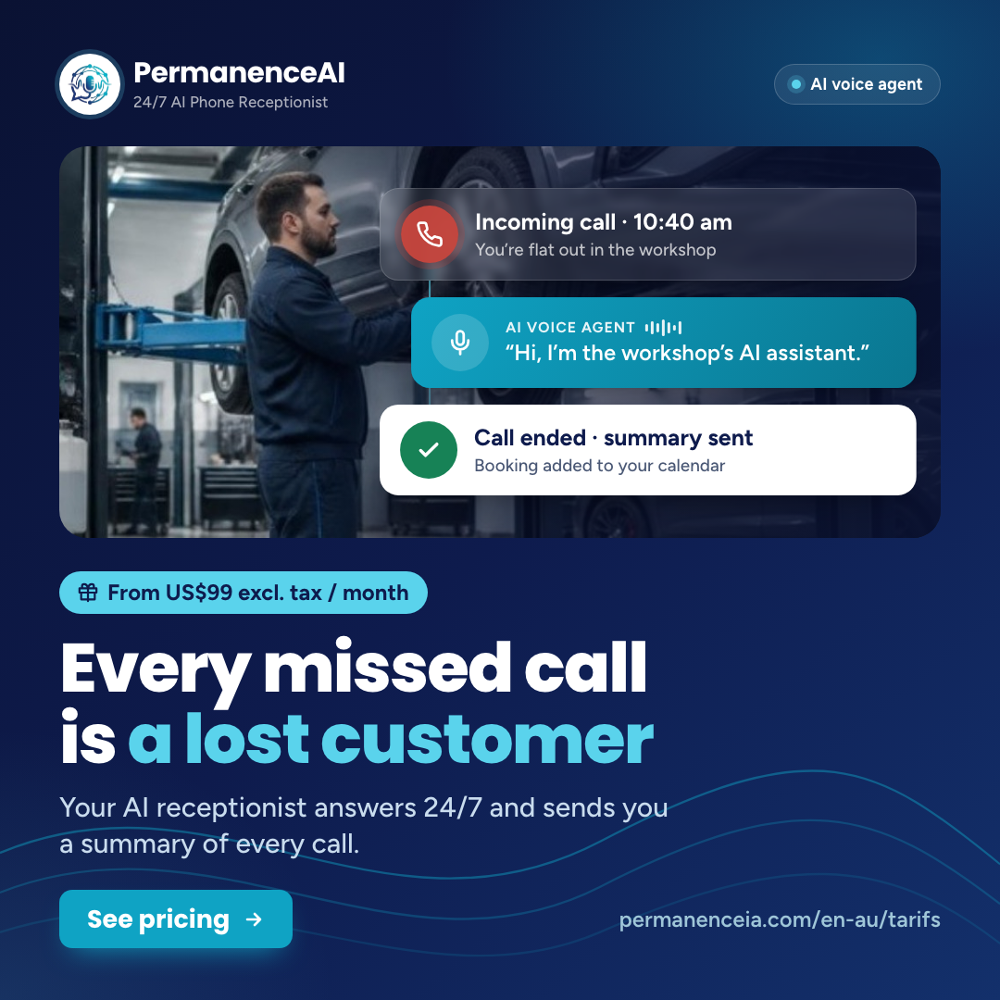
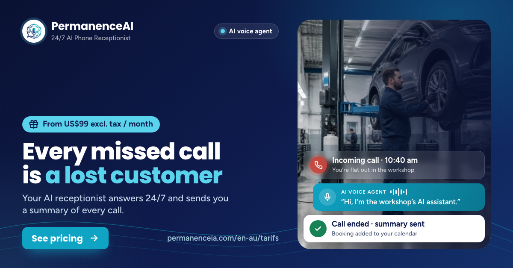
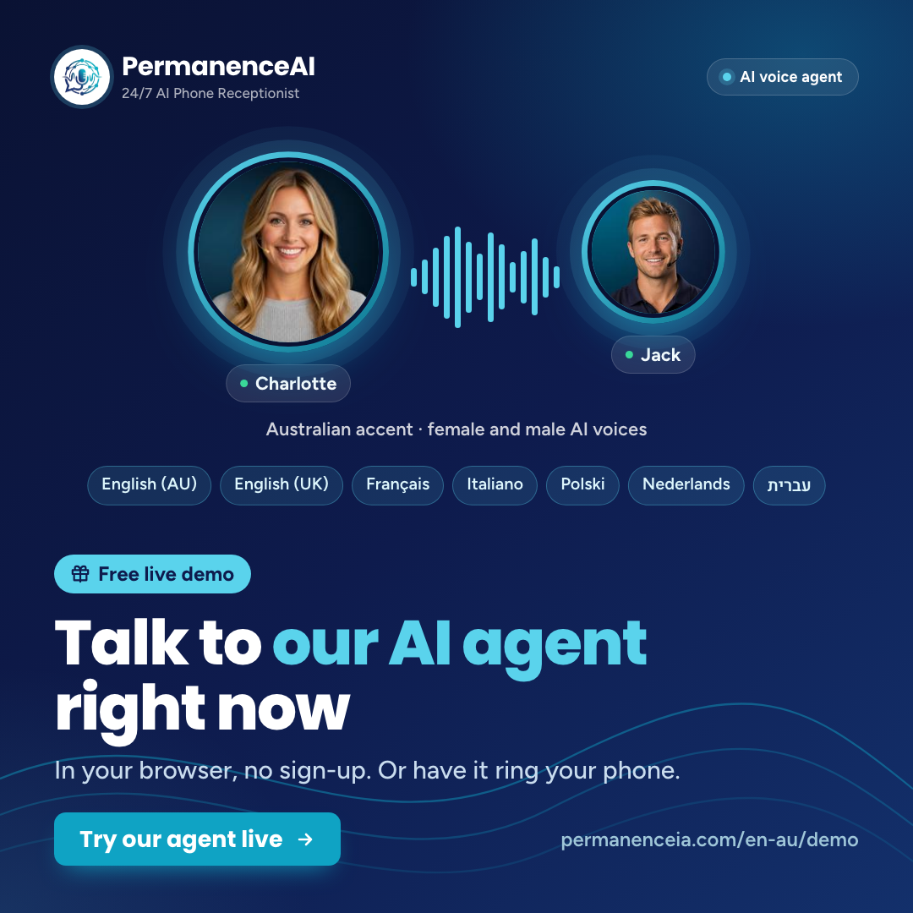
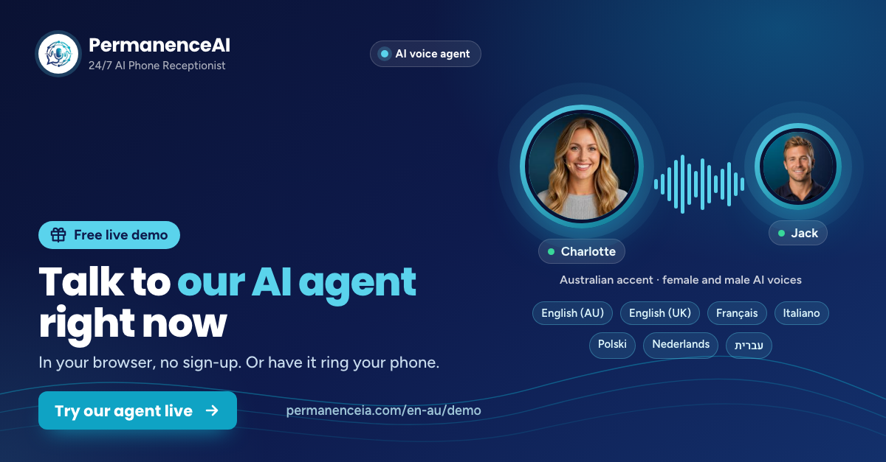
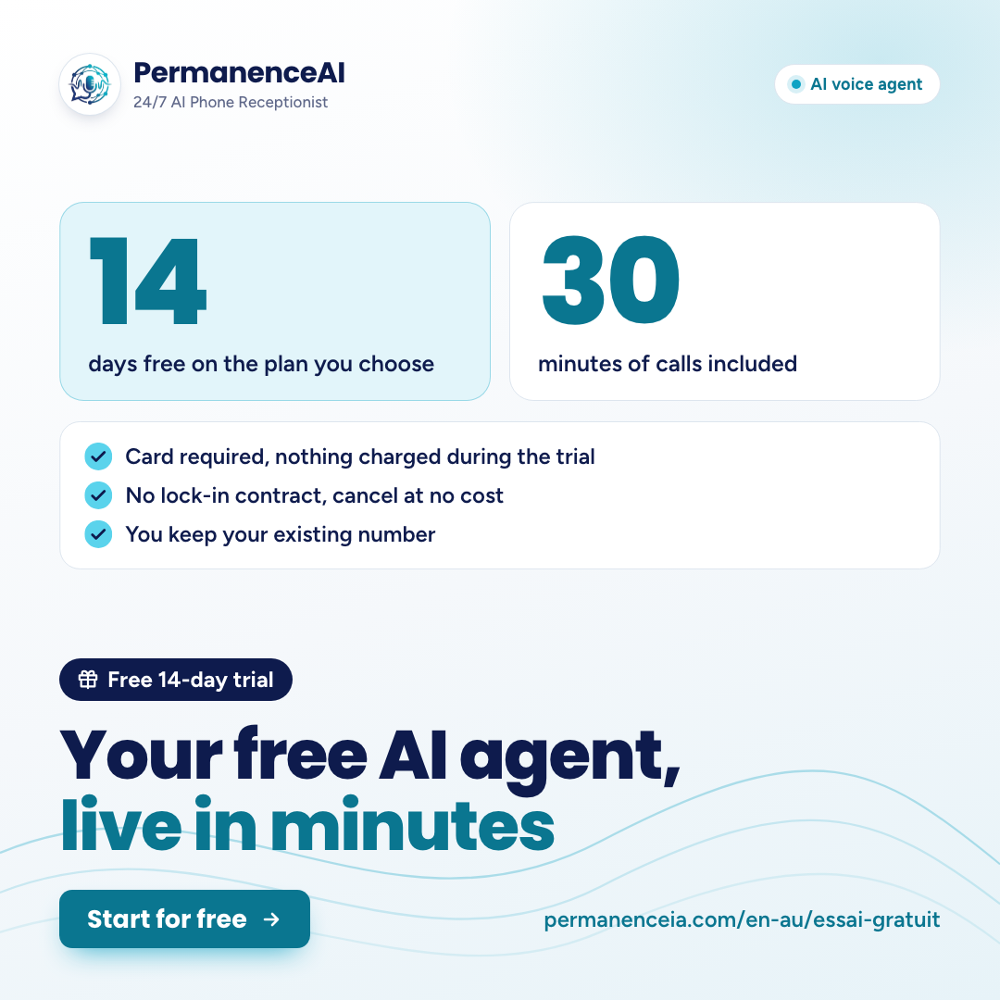
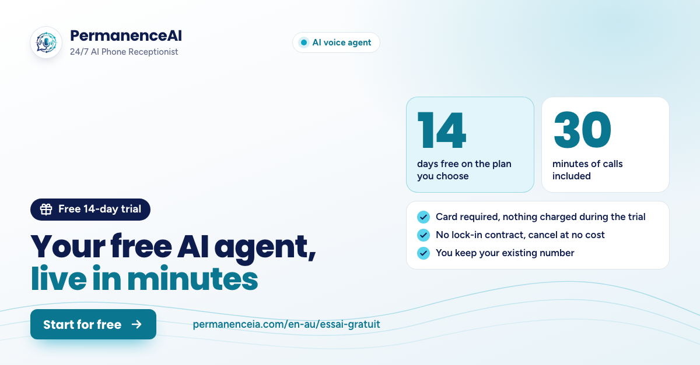

# Posts en-au (Australie, Nouvelle-Zélande) : octobre 2026

Campagne `posts-oct-2026`, marque **PermanenceAI**, slogan « 24/7 AI Phone Receptionist » (`src/i18n/markets.ts`).
Anglais australien, orthographe britannique (organise, enquiries), adresse directe « you » comme sur le site, ton détendu : « tradies », « flat out », « have a yarn », « no lock-in contract » (formule australienne déjà utilisée par le site dans `src/i18n/content/en/au.ts`).
Prix en dollars US hors taxes, au format du site en en-AU : « US$99 excl. tax / month ». Je n’ai pas écrit « ex GST » (ancien guide) : le site dit « excl. tax » et ajoute les taxes locales là où elles s’appliquent.

**Rien n’a été publié.** Aucun compte n’a été ouvert, rien n’a été commité. Textes et visuels sont à valider avant programmation.

## Calendrier

| Date (Sydney) | Thème | LinkedIn | Facebook | Page cible |
|---|---|---|---|---|
| jeu. 15/10/2026 | A | 08:30 (Paris : mer. 14/10 23:30) | 12:30 (Paris : jeu. 15/10 03:30) | /en-au/tarifs |
| jeu. 22/10/2026 | B | 08:30 (Paris : mer. 21/10 23:30) | 12:30 (Paris : jeu. 22/10 03:30) | /en-au/demo |
| jeu. 29/10/2026 | C | 08:30 (Paris : mer. 28/10 22:30) | 12:30 (Paris : jeu. 29/10 02:30) | /en-au/essai-gratuit |

Sydney est en heure d’été (AEDT, UTC+11) depuis le 4 octobre ; Paris passe à l’heure d’hiver le 25 octobre (d’où 22:30 et 02:30 la semaine 3). Pour la Nouvelle-Zélande (NZDT, UTC+13) : 10:30 et 14:30 à Auckland. Pour Perth (UTC+8) : 05:30 et 09:30.

---

## en-au-A : A · « Appel manqué = client perdu » → l’agent IA répond 24/7 (semaine 1)

- **Date proposée :** Jeudi 15/10/2026, heure de Sydney (AEDT, UTC+11) : LinkedIn 08:30 (Paris : mer. 14/10 23:30) · Facebook 12:30 (Paris : jeu. 15/10 03:30). (Auckland : 10:30 / 14:30 · Perth : 05:30 / 09:30)
- **Public :** Tradies, mécaniciens et garages (photo : atelier automobile)
- **Lien Facebook :** https://www.permanenceia.com/en-au/tarifs?utm_source=facebook&utm_medium=social&utm_campaign=posts-oct-2026&utm_content=A
- **Lien LinkedIn :** https://www.permanenceia.com/en-au/tarifs?utm_source=linkedin&utm_medium=social&utm_campaign=posts-oct-2026&utm_content=A
- **Visuels :** `en-au-A-carre.png` (1080×1080, Facebook et LinkedIn) · `en-au-A-linkedin.png` (1200×627, variante LinkedIn)

| Carré 1080×1080 | LinkedIn 1200×627 |
|---|---|
|  |  |

**Texte sur le visuel :** Titre : Every missed call is a lost customer · Pastille : From US$99 excl. tax / month · Sous-titre : Your AI receptionist answers 24/7 and sends you a summary of every call. · Bouton : See pricing · Adresse : permanenceia.com/en-au/tarifs.
3 cartes sur la photo : « Incoming call · 10:40 am / You’re flat out in the workshop » → « AI VOICE AGENT : “Hi, I’m the workshop’s AI assistant.” » → « Call ended · summary sent / Booking added to your calendar ». Photo `public/photos/automobile.jpg` (recadrée pour le carré : `photo-atelier-carre.jpg`, pour que le mécanicien reste visible à gauche des cartes).

### Facebook (79 mots hors lien et hashtags)

```text
On the tools, under a bonnet or up a ladder, and the phone’s ringing again? 🔧

If nobody picks up, that customer might just ring the next business on the list. Your PermanenceAI agent answers 24/7, tells callers upfront that it’s an AI, takes down the details, books the job into your calendar and sends you a summary of every call.

Plans from US$99 excl. tax / month. No setup fee, no lock-in contract, and you keep your number.

👉 See pricing: https://www.permanenceia.com/en-au/tarifs?utm_source=facebook&utm_medium=social&utm_campaign=posts-oct-2026&utm_content=A

#smallbusinessaustralia #tradies #AIreceptionist
```

### LinkedIn (154 mots hors lien et hashtags)

```text
Every missed call is a customer who might be ringing someone else right now.
For tradies, mechanics and workshop owners, the phone always seems to go when your hands are full.

It’s not about being organised. Mid-job, you simply can’t pick up. PermanenceAI gives you an AI receptionist that answers your line 24/7. It tells callers it’s an AI right at the start of the call, takes down the details (the job or the vehicle, address, urgency, preferred time), books straight into your calendar (Google Calendar or Outlook, via Cal.com or Calendly) and sends you a summary of every call.

When a caller needs you personally, it transfers the call or arranges a callback, following the rules you set. You keep your existing number with call forwarding.

No setup fee, no lock-in contract. Plans start at US$99 excl. tax / month, with 350 minutes of calls included.

Compare the plans and what each one includes:
https://www.permanenceia.com/en-au/tarifs?utm_source=linkedin&utm_medium=social&utm_campaign=posts-oct-2026&utm_content=A

#SmallBusinessAustralia #Tradies #AIReceptionist #Automotive #CustomerService
```

### Traduction française du texte Facebook (pour relecture)

```text
Les outils à la main, sous un capot ou en haut d’une échelle, et le téléphone sonne encore ? 🔧

Si personne ne décroche, ce client risque tout simplement d’appeler l’entreprise suivante sur la liste. Votre agent PermanenceAI répond 24 h/24, 7 j/7, annonce d’emblée aux appelants qu’il est une IA, note les détails, inscrit l’intervention dans votre agenda et vous envoie un résumé de chaque appel.

Forfaits dès 99 $US HT / mois. Pas de frais de mise en service, sans engagement, et vous gardez votre numéro.

👉 Voir les tarifs : https://www.permanenceia.com/en-au/tarifs?utm_source=facebook&utm_medium=social&utm_campaign=posts-oct-2026&utm_content=A

#smallbusinessaustralia #tradies #AIreceptionist
```

### Vérifications (partie 7 du brief)

- [x] Chiffres : US$99 excl. tax / month, 350 minutes, 24/7 (partie 1).
- [x] IA : « tells callers upfront that it’s an AI » (Facebook), « tells callers it’s an AI right at the start of the call » (LinkedIn), « AI voice agent » et « AI assistant » sur l’image.
- [x] Aucun secteur santé.
- [x] Lien /en-au/tarifs avec UTM facebook ou linkedin.
- [x] Titre : 7 mots.
- [x] Pas de « rappel automatique » : « arranges a callback ».

**Sources dans le dépôt :** `src/i18n/markets.ts` (basePlans : 99 $, 350 min ; tagline « 24/7 AI Phone Receptionist ») · `src/i18n/index.tsx` (format « US$99 » en en-AU) · `src/i18n/content/en/offers.ts` (OFFER_LABELS « excl. tax / month », agenda Cal.com / Calendly, transfert) · `faq.ts` (détails relevés, rappel organisé, pas de frais de mise en service, renvoi d’appel) · `ui/components.ts` (`liveCall.ended` « Call ended · summary sent ») · `ui/pages.ts` (« See pricing ») · `sectors.ts` automobile.

---

## en-au-B : B · « Entendez-le vous-même » → démo en direct (semaine 2)

- **Date proposée :** Jeudi 22/10/2026, heure de Sydney (AEDT, UTC+11) : LinkedIn 08:30 (Paris : mer. 21/10 23:30) · Facebook 12:30 (Paris : jeu. 22/10 03:30). (Auckland : 10:30 / 14:30 · Perth : 05:30 / 09:30)
- **Public :** Toutes PME d’Australie et de Nouvelle-Zélande (voix Charlotte et Jack)
- **Lien Facebook :** https://www.permanenceia.com/en-au/demo?utm_source=facebook&utm_medium=social&utm_campaign=posts-oct-2026&utm_content=B
- **Lien LinkedIn :** https://www.permanenceia.com/en-au/demo?utm_source=linkedin&utm_medium=social&utm_campaign=posts-oct-2026&utm_content=B
- **Visuels :** `en-au-B-carre.png` (1080×1080, Facebook et LinkedIn) · `en-au-B-linkedin.png` (1200×627, variante LinkedIn)

| Carré 1080×1080 | LinkedIn 1200×627 |
|---|---|
|  |  |

**Texte sur le visuel :** Titre : Talk to our AI agent right now · Pastille : Free live demo · Sous-titre : In your browser, no sign-up. Or have it ring your phone. · Bouton : Try our agent live · Adresse : permanenceia.com/en-au/demo.
Portraits de Charlotte et Jack (illustrations générées, pas des personnes réelles), onde sonore, légende « Australian accent · female and male AI voices », puces des 7 accents de la démo : English (AU), English (UK), Français, Italiano, Polski, Nederlands, עברית.

### Facebook (72 mots hors lien et hashtags)

```text
What does an AI receptionist actually sound like? Don’t take our word for it: have a yarn with one. 🎧

Charlotte and Jack, our AI voices with an Australian accent, are live on our website. Pick a voice and talk in your browser, no sign-up needed, or have the agent ring your phone during business hours (Sydney time). Ask what your customers would ask, change your mind, interrupt it mid-sentence.

Free live demo 👉 https://www.permanenceia.com/en-au/demo?utm_source=facebook&utm_medium=social&utm_campaign=posts-oct-2026&utm_content=B

#AIreceptionist #smallbusinessaustralia
```

### LinkedIn (143 mots hors lien et hashtags)

```text
The quickest way to judge an AI receptionist? Talk to one.
No slides, no sales pitch: just you and our AI agent, live.

On our demo page, you choose a role (receptionist, sales or support), your trade and a voice. In Australian English, that’s Charlotte or Jack. Then you talk to the agent straight from your browser, by voice or by typing, no sign-up needed. Rather hear it on a real call? Have it ring your phone during business hours, Sydney time.

Test it the way your customers would: ask about availability, change your mind halfway through, interrupt it. It tells you from the start that it’s an AI, exactly as it does with every caller. And when a caller speaks another language, your agent detects it and replies in that language, with more than 80 languages available.

Hear it for yourself, free:
https://www.permanenceia.com/en-au/demo?utm_source=linkedin&utm_medium=social&utm_campaign=posts-oct-2026&utm_content=B

#AIReceptionist #SmallBusinessAustralia #VoiceAI #CustomerExperience
```

### Traduction française du texte Facebook (pour relecture)

```text
À quoi ressemble vraiment un réceptionniste IA ? Ne nous croyez pas sur parole : venez bavarder avec l’un d’eux (« have a yarn », expression australienne pour « discuter »). 🎧

Charlotte et Jack, nos voix IA à l’accent australien, vous attendent en direct sur notre site. Choisissez une voix et parlez depuis votre navigateur, sans inscription, ou faites-vous appeler par l’agent sur votre téléphone pendant les heures d’ouverture (heure de Sydney). Posez les questions que poseraient vos clients, changez d’avis, coupez-lui la parole en pleine phrase.

Démo gratuite en direct 👉 https://www.permanenceia.com/en-au/demo?utm_source=facebook&utm_medium=social&utm_campaign=posts-oct-2026&utm_content=B

#AIreceptionist #smallbusinessaustralia
```

### Vérifications (partie 7 du brief)

- [x] Aucun chiffre hors partie 1 (plus de 80 langues, 7 accents, 3 rôles).
- [x] IA : « AI voices », « tells you from the start that it’s an AI » ; « AI voice agent » et « AI voices » sur l’image.
- [x] Aucun secteur santé.
- [x] Lien /en-au/demo avec UTM.
- [x] Titre : 7 mots.
- [x] Pas de rappel automatique promis.

**Sources dans le dépôt :** `src/data/personas.ts` (en-au : Charlotte, Jack) · `ui/components.ts` liveDemo (titre, 3 rôles, métier, navigateur micro ou écrit, « Ring my phone », accent « Australian English ») · `au.ts` (horaires à l’heure de Sydney) · `src/data/kb/en.txt` (lun.–sam. 9:00–12:30 et 14:00–19:00, heure de Sydney) · `ui/pages.ts` demo (« interrupt it », « change your mind ») · liveDemo.browserText (micro ou clavier, sans compte) · `offers.ts` MATRIX (détection de la langue) · trialNudge (plus de 80 langues).

---

## en-au-C : C · « Essayez gratuitement » → essai de 14 jours (semaine 3)

- **Date proposée :** Jeudi 29/10/2026, heure de Sydney (AEDT, UTC+11) : LinkedIn 08:30 (Paris : mer. 28/10 22:30, après le passage à l’heure d’hiver) · Facebook 12:30 (Paris : jeu. 29/10 02:30). (Auckland : 10:30 / 14:30 · Perth : 05:30 / 09:30)
- **Public :** Toutes PME d’Australie et de Nouvelle-Zélande
- **Lien Facebook :** https://www.permanenceia.com/en-au/essai-gratuit?utm_source=facebook&utm_medium=social&utm_campaign=posts-oct-2026&utm_content=C
- **Lien LinkedIn :** https://www.permanenceia.com/en-au/essai-gratuit?utm_source=linkedin&utm_medium=social&utm_campaign=posts-oct-2026&utm_content=C
- **Visuels :** `en-au-C-carre.png` (1080×1080, Facebook et LinkedIn) · `en-au-C-linkedin.png` (1200×627, variante LinkedIn)

| Carré 1080×1080 | LinkedIn 1200×627 |
|---|---|
|  |  |

**Texte sur le visuel :** Titre : Your free AI agent, live in minutes · Pastille : Free 14-day trial · Bouton : Start for free · Adresse : permanenceia.com/en-au/essai-gratuit.
Fond clair. Deux chiffres « 14 · days free on the plan you choose » et « 30 · minutes of calls included », puis 3 points : « Card required, nothing charged during the trial » · « No lock-in contract, cancel at no cost » · « You keep your existing number ».

### Facebook (96 mots hors lien et hashtags)

```text
Your free AI agent is ready when you are. ⚡

Try PermanenceAI free for 14 days, with 30 minutes of calls included. Your first agent can be up and running in minutes: it answers 24/7, says it’s an AI and sends you a summary of every call. You keep your existing number.

Card details are needed to activate, but nothing is charged during the trial. No lock-in contract: cancel before the 14 days are up and you pay nothing. If you don’t cancel, your chosen plan kicks in at the end of the trial.

👉 Start for free: https://www.permanenceia.com/en-au/essai-gratuit?utm_source=facebook&utm_medium=social&utm_campaign=posts-oct-2026&utm_content=C

#AIreceptionist #smallbusinessaustralia
```

### LinkedIn (174 mots hors lien et hashtags)

```text
Curious about an AI receptionist but not ready to commit? Try it on your own calls first.
Our free trial gives you 14 days on the plan you choose, with 30 minutes of calls included.

Your first AI agent can be live within minutes. A full setup with your calendar, numbers and transfers usually takes one to two days, and we help you through it. The agent answers 24/7, says it’s an AI at the start of every call, books appointments and sends you a summary of each conversation.

The fine print, in plain English:
• Card details are required on activation, but nothing is charged during the trial.
• Once the 30 minutes are used up, calls pause until the trial ends or you start your plan.
• No lock-in contract, no setup fee. Cancel before the end at no cost; we email you a reminder 7 days before the trial ends.
• If you don’t cancel, your chosen plan starts at the end of the 14 days.
• You keep your existing number.

Start your free trial:
https://www.permanenceia.com/en-au/essai-gratuit?utm_source=linkedin&utm_medium=social&utm_campaign=posts-oct-2026&utm_content=C

#AIReceptionist #SmallBusinessAustralia #VoiceAI #FreeTrial
```

### Traduction française du texte Facebook (pour relecture)

```text
Votre agent IA gratuit est prêt quand vous l’êtes. ⚡

Essayez PermanenceAI gratuitement pendant 14 jours, avec 30 minutes d’appels incluses. Votre premier agent peut être opérationnel en quelques minutes : il répond 24 h/24, 7 j/7, dit qu’il est une IA et vous envoie un résumé de chaque appel. Vous gardez votre numéro actuel.

Une carte est demandée à l’activation, mais rien n’est débité pendant l’essai. Sans engagement (« no lock-in contract ») : annulez avant la fin des 14 jours et vous ne payez rien. Si vous n’annulez pas, le forfait choisi démarre à la fin de l’essai.

👉 Démarrer gratuitement : https://www.permanenceia.com/en-au/essai-gratuit?utm_source=facebook&utm_medium=social&utm_campaign=posts-oct-2026&utm_content=C

#AIreceptionist #smallbusinessaustralia
```

### Vérifications (partie 7 du brief)

- [x] Chiffres : 14 jours, 30 minutes, 7 jours avant la fin, 1 à 2 jours (partie 1).
- [x] IA : « Your free AI agent », « says it’s an AI ».
- [x] « Card details are needed to activate, but nothing is charged during the trial » et le démarrage du forfait à la fin de l’essai sauf annulation : écrits dans les deux textes.
- [x] Aucun secteur santé.
- [x] Lien /en-au/essai-gratuit avec UTM.
- [x] Titre : 7 mots.

**Sources dans le dépôt :** `markets.ts` trial {days: 14, minutes: 30} · `offers.ts` decouverte (« 14 days on the plan of your choice », « Card requested, nothing charged during the trial ») · `au.ts` trialNudge (« no lock-in contract ») · `faq.ts` (après les 30 minutes, rappel e-mail 7 jours avant, forfait qui démarre sauf annulation, 1 à 2 jours pour la configuration complète, pas de frais de mise en service) · `ui/components.ts` (`ctas.primary` « Start for free », « Up and running in minutes, and you keep your number »).

---

## Refaire les visuels

```
node docs/marketing/posts-2026-10/en-au/render.mjs docs/marketing/posts-2026-10/en-au/visuels.json <dossier>
```

Le script produit `en-au-<thème>_1080x1080.png` et `en-au-<thème>_1200x627.png` ; ils ont été renommés en `en-au-<thème>-carre.png` et `en-au-<thème>-linkedin.png`. `post.html` et `render.mjs` sont des copies inchangées du gabarit ; tous les textes sont dans `visuels.json` (le titre B garde « our AI agent » sur une ligne et le sous-titre A garde « a summary of every call » ensemble, grâce à des espaces insécables).

## Points à trancher

- **Facebook :** la page « Permanence IA » est commune aux 7 langues. Les posts en-au (anglais) partent à 03:30 heure de Paris : il faut restreindre l’audience à l’Australie et à la Nouvelle-Zélande dans Meta Business Suite si l’option existe, sinon ils apparaîtront aussi aux abonnés européens. Ils sont proches des posts en-gb (même langue) : visuels et photos différents (garage ici, immobilier pour en-gb).
- **LinkedIn :** aucune page entreprise n’existe encore, il faut la créer avant de programmer.
- **Démo par téléphone :** horaires à l’heure de Sydney (lun.–sam. 9:00–12:30 et 14:00–19:00). Pour la Nouvelle-Zélande (2 h d’avance) et Perth (3 h de retard), les créneaux paraissent décalés ; la démo dans le navigateur reste disponible à toute heure.
- **Pas de ligne publique australienne :** la variante « appelez ce numéro, une IA répond » n’existe que pour le Royaume-Uni et Israël.
- **Ton :** « have a yarn » (B, Facebook), « on the tools » (A, Facebook) et « flat out » (A, visuel) sont des expressions australiennes courantes ; à remplacer par « have a chat », « on the job » et « busy in the workshop » si vous les jugez trop familières.
- **Titre A :** « Every missed call is a lost customer » est une formule d’accroche (thème A), pas une statistique ; les textes nuancent (« might just ring the next business », « might be ringing someone else »).

## Relecture native (anglais australien) et vérification des faits : 9 octobre 2026

Faits revérifiés dans le dépôt : `markets.ts` (Réceptionniste 99 $ / 350 min, essai 14 jours / 30 min, marque PermanenceAI, slogan « 24/7 AI Phone Receptionist ») ; `index.tsx` (format « US$99 » en en-AU, confirmé sur la page en ligne /en-au/tarifs) ; `offers.ts` (essai sur le forfait choisi, carte demandée sans débit, agenda via Cal.com / Calendly, détection de la langue) ; `faq.ts` (1 à 2 jours pour la configuration complète, arrêt des appels après 30 min « jusqu’à la fin de l’essai ou jusqu’au démarrage de l’abonnement », rappel 7 jours avant, pas de frais de mise en service, renvoi d’appel, l’agent dit toujours en début d’appel qu’il est une IA) ; `components.ts` (liveDemo : 3 rôles, métier, navigateur micro ou clavier, « Ring my phone », accent « Australian English » ; trialNudge : plus de 80 langues) ; `au.ts` (« no lock-in contract », heure de Sydney) ; `personas.ts` (Charlotte et Jack) ; `kb/en.txt` (lun.–sam. 9:00–12:30 et 14:00–19:00, heure de Sydney). Liens : `src/pages/{tarifs,demo,essai-gratuit}.tsx` existent, `en-au` est dans `src/i18n/locales.ts` et `next.config` ; les 6 URL avec UTM répondent 200. Calendrier recalculé (jeudis 15, 22 et 29 oct. ; heure d’été de Sydney depuis le dim. 4 oct. ; Paris à l’heure d’hiver le dim. 25 oct.) : exact.

Corrections apportées :
- A LinkedIn : « introduces itself as an AI from the first sentence » → « tells callers it’s an AI right at the start of the call » (formulation du site, sans promesse sur la « première phrase ») ; « collects » → « takes down » ; l’agenda est précisé (« Google Calendar or Outlook, via Cal.com or Calendly »), comme dans la FAQ.
- A Facebook : ajout de « no lock-in contract » (sans engagement, confirmé par la FAQ et `au.ts`).
- A visuel : sous-titre « sends you the summary » (article flou) → « sends you a summary of every call » ; espaces insécables pour garder le groupe sur la 2e ligne ; carré et LinkedIn régénérés et revus.
- B Facebook : « Chat in your browser » (laisse croire à un échange écrit seulement) → « Pick a voice and talk in your browser, no sign-up needed » ; « have one of them ring your phone » → « have the agent ring your phone » ; « interrupt. » (tronqué) → « interrupt it mid-sentence ».
- B LinkedIn : « by voice or in writing, with no sign-up » → « by voice or by typing, no sign-up needed » ; « Ask it to ring your phone » → « Have it ring your phone » (on remplit un formulaire, on ne le demande pas à l’agent) ; « across more than 80 languages » (tournure calquée) → « with more than 80 languages available », rattaché à « your agent ».
- B visuel : « Or it rings your phone. » → « Or have it ring your phone. » (l’appel n’est pas automatique, il faut le demander) ; carré et LinkedIn régénérés et revus.
- C Facebook : phrase finale scindée et clarifiée (« cancel before the 14 days are up and you pay nothing. If you don’t cancel, your chosen plan kicks in at the end of the trial »).
- C LinkedIn : « calls pause until the trial ends » → « … until the trial ends or you start your plan » (FAQ exacte) ; « a reminder email arrives 7 days before » → « we email you a reminder 7 days before the trial ends » ; point-virgule remplacé par deux phrases.
- Traductions françaises refaites pour suivre les nouveaux textes Facebook.
