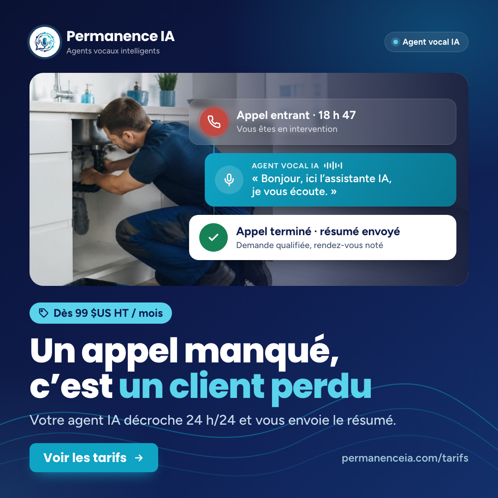
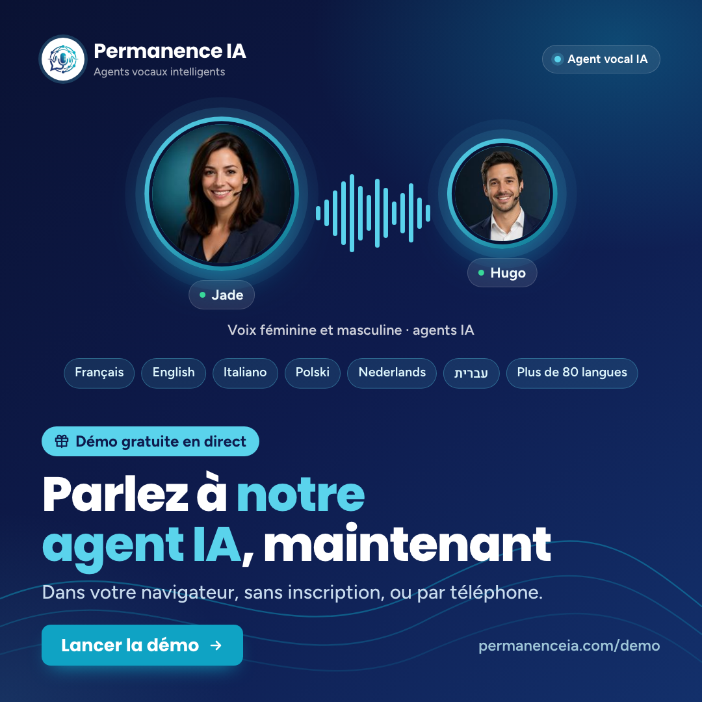
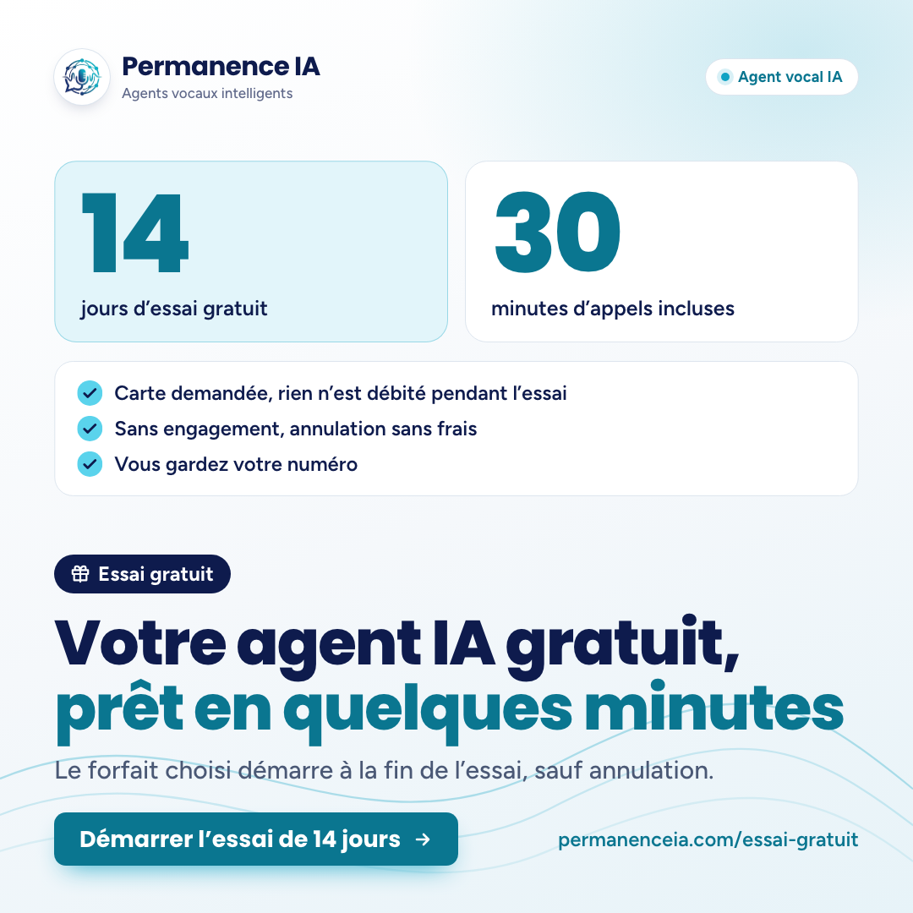

# Publications Facebook et LinkedIn : français, octobre 2026

Campagne `posts-oct-2026` · Permanence IA · public : France, Belgique, Suisse, Luxembourg, Canada (vouvoiement).

**Statut : version finale, relue le 9 octobre 2026 (relecture native, vérification des faits dans le dépôt, visuels revus un à un). Rien n’a été publié.** Aucune connexion à Facebook ni à LinkedIn, aucun message envoyé, rien de modifié sur le site, aucun commit.

## Calendrier

| Post | Thème | Date | LinkedIn | Facebook | Page cible |
|---|---|---|---|---|---|
| fr-A | Appel manqué = client perdu | mar. 13/10/2026 | 08:30 | 12:15 | `/tarifs` |
| fr-B | Démo en direct | mar. 20/10/2026 | 08:30 | 12:15 | `/demo` |
| fr-C | Essai gratuit | mar. 27/10/2026 | 08:30 | 12:15 | `/essai-gratuit` |

Heure de Paris : UTC+2 les 13 et 20 octobre, UTC+1 le 27 octobre (passage à l’heure d’hiver le dimanche 25 octobre). Les mêmes mardis, l’italien passe à 12:45 sur LinkedIn (4 h 15 après le français) et à 09:00 sur Facebook.

**Écart à trancher sur Facebook :** entre l’italien (09:00) et le français (12:15), il n’y a que 3 h 15, alors que le brief demande au moins 3 h 30 sur chaque plateforme. Proposition : passer le français à **12:30** sur Facebook les trois mardis. Les heures ci-dessus restent celles du brief tant que ce n’est pas décidé.

## Visuels

Le carré 1080×1080 sert pour Facebook (et peut aussi servir pour LinkedIn). Le 1200×627 est la variante LinkedIn.

| Post | Carré 1080×1080 | LinkedIn 1200×627 |
|---|---|---|
| fr-A | `fr-A-carre.png` | `fr-A-linkedin.png` |
| fr-B | `fr-B-carre.png` | `fr-B-linkedin.png` |
| fr-C | `fr-C-carre.png` | `fr-C-linkedin.png` |

Pour les refaire : `node docs/marketing/posts-2026-10/fr/render.mjs docs/marketing/posts-2026-10/fr/visuels.json`. Ce script est une copie du gabarit commun ; seuls le nom des fichiers produits et une icône « étiquette de prix » pour la pastille du post A ont changé (`badgeicon=tag`).

---

## fr-A · « Appel manqué = client perdu » : l’agent vocal IA répond 24 h/24 (page Tarifs, public artisans)

**Date proposée :** mardi 13 octobre 2026, heure de Paris (UTC+2) : LinkedIn 08:30, Facebook 12:15.



**Texte du visuel :** titre « Un appel manqué, c’est un client perdu » (7 mots).

Autres éléments : pastille « Dès 99 $US HT / mois » (icône étiquette de prix) · sous-titre « Votre agent IA décroche 24 h/24 et vous envoie le résumé. » · bouton « Voir les tarifs » · URL permanenceia.com/tarifs · photo services à domicile (artisan sous un évier) · 3 cartes : « Appel entrant · 18 h 47 / Vous êtes en intervention », « AGENT VOCAL IA : Bonjour, ici l’assistante IA, je vous écoute. », « Appel terminé · résumé envoyé / Demande qualifiée, rendez-vous noté ». La mention « Agent vocal IA » apparaît en haut à droite.

**Liens :**
- Facebook : https://www.permanenceia.com/tarifs?utm_source=facebook&utm_medium=social&utm_campaign=posts-oct-2026&utm_content=A
- LinkedIn : https://www.permanenceia.com/tarifs?utm_source=linkedin&utm_medium=social&utm_campaign=posts-oct-2026&utm_content=A

### Facebook (76 mots, 2 émojis, 3 hashtags) · image `fr-A-carre.png`

```text
Vous êtes sur un chantier, les mains prises, et le téléphone sonne. 📞
Un appel manqué, c’est souvent un client qui appelle ailleurs.

Votre agent vocal IA décroche à votre place, 24 h/24 et 7 j/7. Il se présente comme une IA, qualifie la demande, réserve le rendez-vous dans votre agenda et vous envoie le résumé de l’appel. Vous gardez votre numéro.

Forfait Réceptionniste : 99 $US HT par mois, 350 minutes incluses, sans engagement.
👉 Voir les tarifs : https://www.permanenceia.com/tarifs?utm_source=facebook&utm_medium=social&utm_campaign=posts-oct-2026&utm_content=A

#artisan #TPE #agentIA
```

### LinkedIn (151 mots, 5 hashtags) · image `fr-A-linkedin.png`

```text
Un appel manqué, c’est souvent une demande qui part chez un concurrent.
Et ce n’est pas forcément une question d’organisation : en intervention, en rendez-vous ou au comptoir, on ne peut tout simplement pas décrocher.

Avec Permanence IA, un agent vocal IA répond sur votre ligne, 24 h/24 et 7 j/7. Il se présente comme une IA dès le début de l’appel, répond aux questions courantes, qualifie la demande (nature du besoin, adresse, urgence, créneau), réserve le rendez-vous dans votre agenda via Cal.com ou Calendly et vous envoie le résumé de chaque appel. Si la demande sort du cadre, il transfère l’appel à votre équipe ou organise votre rappel, selon vos règles.

Vous gardez votre numéro : un simple renvoi d’appel suffit, sans changer d’opérateur ni de matériel.

Le forfait Réceptionniste est à 99 $US HT par mois, avec 350 minutes incluses, sans engagement ni frais de mise en service.
→ Comparez les forfaits : https://www.permanenceia.com/tarifs?utm_source=linkedin&utm_medium=social&utm_campaign=posts-oct-2026&utm_content=A

#TPE #PME #artisans #agentvocalIA #standardtéléphonique
```

---

## fr-B · « Entendez-le vous-même » : démo en direct, gratuite (page Démo)

**Date proposée :** mardi 20 octobre 2026, heure de Paris (UTC+2) : LinkedIn 08:30, Facebook 12:15.



**Texte du visuel :** titre « Parlez à notre agent IA, maintenant » (6 mots).

Autres éléments : pastille « Démo gratuite en direct » · sous-titre « Dans votre navigateur, sans inscription, ou par téléphone. » · bouton « Lancer la démo » · URL permanenceia.com/demo · portraits illustrés de Jade et Hugo, onde sonore, légende « Voix féminine et masculine · agents IA », puces Français, English, Italiano, Polski, Nederlands, עברית, Plus de 80 langues. La mention « Agent vocal IA » apparaît en haut à droite.

**Liens :**
- Facebook : https://www.permanenceia.com/demo?utm_source=facebook&utm_medium=social&utm_campaign=posts-oct-2026&utm_content=B
- LinkedIn : https://www.permanenceia.com/demo?utm_source=linkedin&utm_medium=social&utm_campaign=posts-oct-2026&utm_content=B

### Facebook (62 mots, 2 émojis, 2 hashtags) · image `fr-B-carre.png`

```text
Ne nous croyez pas sur parole : parlez à notre agent IA. 🎙️
Il vous répond en direct dans votre navigateur, gratuitement et sans inscription. Vous préférez le téléphone ? Laissez votre numéro : il vous appelle aux heures d’ouverture.

Choisissez son rôle (réceptionniste, commercial ou support) et sa voix, Jade ou Hugo. Interrompez-le, posez vos questions : trente secondes suffisent pour vous faire une idée.
👉 Essayez-le : https://www.permanenceia.com/demo?utm_source=facebook&utm_medium=social&utm_campaign=posts-oct-2026&utm_content=B

#agentIA #démo
```

### LinkedIn (158 mots, 5 hashtags) · image `fr-B-linkedin.png`

```text
Le meilleur moyen de juger un agent vocal IA, c’est de lui parler.
Pas de vidéo, pas de brochure : une vraie conversation, tout de suite, gratuitement.

Sur notre page démo, vous choisissez un rôle (réceptionniste, commercial ou support), l’un des sept accents proposés et une voix féminine ou masculine (Jade ou Hugo en français). Vous lui parlez au micro ou par écrit, directement dans votre navigateur, sans inscription. Vous préférez le téléphone ? Laissez votre numéro : l’agent vous appelle aux heures d’ouverture, du lundi au samedi de 9 h à 12 h 30 et de 14 h à 19 h (heure de Paris).

Mettez-vous à la place de vos clients : interrompez-le, changez d’avis, posez la question qu’on vous pose sans arrêt. Et une fois en service chez vous, votre agent se présente toujours comme une IA dès le début de l’appel, puis répond à chaque appelant dans sa langue (plus de 80 sont disponibles).

→ Lancez la démo en direct : https://www.permanenceia.com/demo?utm_source=linkedin&utm_medium=social&utm_campaign=posts-oct-2026&utm_content=B

#agentvocalIA #IA #relationclient #TPE #PME
```

---

## fr-C · « Essayez gratuitement » : votre agent IA gratuit, 14 jours et 30 minutes (page Essai gratuit)

**Date proposée :** mardi 27 octobre 2026, heure de Paris (UTC+1, après le passage à l’heure d’hiver du 25 octobre) : LinkedIn 08:30, Facebook 12:15.



**Texte du visuel :** titre « Votre agent IA gratuit, prêt en quelques minutes » (8 mots).

Autres éléments : pastille « Essai gratuit » · sous-titre « Le forfait choisi démarre à la fin de l’essai, sauf annulation. » · bouton « Démarrer l’essai de 14 jours » · URL permanenceia.com/essai-gratuit · fond clair · chiffres « 14 jours d’essai gratuit » et « 30 minutes d’appels incluses » · 3 points : « Carte demandée, rien n’est débité pendant l’essai », « Sans engagement, annulation sans frais », « Vous gardez votre numéro ». La mention « Agent vocal IA » apparaît en haut à droite.

**Liens :**
- Facebook : https://www.permanenceia.com/essai-gratuit?utm_source=facebook&utm_medium=social&utm_campaign=posts-oct-2026&utm_content=C
- LinkedIn : https://www.permanenceia.com/essai-gratuit?utm_source=linkedin&utm_medium=social&utm_campaign=posts-oct-2026&utm_content=C

### Facebook (65 mots, 2 émojis, 2 hashtags) · image `fr-C-carre.png`

```text
Votre agent IA gratuit, prêt en quelques minutes. 🎁
14 jours d’essai sur le forfait de votre choix, avec 30 minutes d’appels incluses. Il répond 24 h/24, prend vos rendez-vous et vous envoie le résumé de chaque appel. Vous gardez votre numéro.

Carte demandée à l’activation, rien n’est débité pendant l’essai ; le forfait démarre à la fin sauf annulation. Sans engagement, annulation sans frais.
👉 Démarrer l’essai : https://www.permanenceia.com/essai-gratuit?utm_source=facebook&utm_medium=social&utm_campaign=posts-oct-2026&utm_content=C

#essaigratuit #agentIA
```

### LinkedIn (143 mots, 5 hashtags) · image `fr-C-linkedin.png`

```text
Et si vous testiez un agent vocal IA sur vos propres appels, pendant 14 jours, gratuitement ?
Un premier agent est prêt en quelques minutes, et vous gardez votre numéro.

L’essai, c’est 14 jours sur le forfait de votre choix, avec 30 minutes d’appels incluses. Votre agent se présente comme une IA, répond 24 h/24 dans plus de 80 langues, prend les rendez-vous, qualifie les demandes et vous envoie le résumé de chaque appel. Pour une configuration complète (agenda, numéros, transferts), comptez en général un à deux jours, avec notre accompagnement.

Les conditions, en clair : carte demandée à l’activation, rien n’est débité pendant l’essai ; le forfait démarre à la fin sauf annulation. Sans engagement ni frais de mise en service : vous annulez sans frais depuis votre espace, et un e-mail vous prévient 7 jours avant la fin de l’essai.

→ Démarrez l’essai de 14 jours : https://www.permanenceia.com/essai-gratuit?utm_source=linkedin&utm_medium=social&utm_campaign=posts-oct-2026&utm_content=C

#essaigratuit #agentvocalIA #TPE #PME #standardtéléphonique
```

---

## Validation (contrôles de la partie 7 du brief, refaits après relecture)

| Contrôle | fr-A | fr-B | fr-C |
|---|---|---|---|
| Chaque chiffre vient du dépôt | oui : 99 $US HT, 350 min, 24 h/24 et 7 j/7 (`markets.ts`, `trialNudge`) | oui : 3 rôles, 7 accents, voix féminine ou masculine par accent, horaires du rappel, plus de 80 langues (`liveDemo`, `personas.ts`) | oui : 14 jours, 30 min, rappel 7 jours avant, 1 à 2 jours de configuration (`offers.ts`, `faq.ts`, `trialNudge`) |
| Mention « IA » dans le texte et sur l’image | oui | oui | oui |
| Aucun secteur santé, aucune promesse de conformité santé | oui (artisans) | oui | oui |
| Page existante (`src/pages`), langue `fr` à la racine, UTM facebook ou linkedin + utm_content | `/tarifs` A | `/demo` B | `/essai-gratuit` C |
| Titre du visuel de 8 mots au maximum | 7 | 6 | 8 |
| « Carte demandée, rien n’est débité pendant l’essai » écrit | sans objet | sans objet | oui, texte et image |
| Pas de « rappel automatique » sans le forfait Assistant | oui : « organise votre rappel » | oui | oui |
| Pas de résultat chiffré promis | oui | oui | oui |
| Longueur : Facebook 40 à 90 mots, LinkedIn 120 à 200 mots | 76 / 151 | 62 / 158 | 65 / 143 |
| Typographie : espaces insécables avant ; : ! ? et dans « » (même règle que `src/i18n/typography.ts`), et dans « 24 h/24 », « 99 $US HT », les horaires | oui | oui | oui |
| Images relues une à une : dimensions, polices du site, rien de coupé | oui | oui | oui (refaites le 9 octobre) |

## Relecture du 9 octobre 2026 : ce qui a changé

- **fr-A, Facebook :** « Forfait Réceptionniste dès 99 $US HT / mois » devient « Forfait Réceptionniste : 99 $US HT par mois ». Le forfait coûte 99 $US par mois en facturation mensuelle (82,50 $US par mois en annuel) : « dès » ne convient pas pour un forfait précis. « Il annonce qu’il est une IA » devient « Il se présente comme une IA », et « note le rendez-vous » devient « réserve le rendez-vous » (formule du site).
- **fr-A, LinkedIn :** « ce n’est presque jamais une question d’organisation » (affirmation générale invérifiable) devient « ce n’est pas forcément une question d’organisation ». « Permanence IA place un agent vocal IA sur votre ligne » devient « Avec Permanence IA, un agent vocal IA répond sur votre ligne ». « Le forfait Réceptionniste démarre à 99 $US » (calque de l’anglais *starts at*) devient « est à 99 $US HT par mois ».
- **fr-B, LinkedIn (fait corrigé) :** « un accent parmi sept et une voix, Jade ou Hugo » laissait croire que Jade et Hugo parlent les sept accents. Dans la démo, chaque accent a sa propre voix féminine et sa propre voix masculine (`src/data/personas.ts`) ; Jade et Hugo sont les voix françaises. Nouvelle phrase : « l’un des sept accents proposés et une voix féminine ou masculine (Jade ou Hugo en français) ». Fin du post : « parmi plus de 80 langues » devient « (plus de 80 sont disponibles) », pour éviter la répétition « langue / langues ».
- **fr-B, Facebook :** l’accroche « parlez-lui » ne disait pas à qui ; elle devient « parlez à notre agent IA ». La phrase suivante est plus fluide : « Il vous répond en direct dans votre navigateur, gratuitement et sans inscription ».
- **fr-C, LinkedIn :** « L’essai vous donne 14 jours… et 30 minutes d’appels » devient « L’essai, c’est 14 jours sur le forfait de votre choix, avec 30 minutes d’appels incluses ». La dernière phrase, une liste sans verbe, devient « vous annulez sans frais depuis votre espace, et un e-mail vous prévient 7 jours avant la fin de l’essai ». La phrase exigée par le brief est gardée mot pour mot.
- **fr-C, visuels :** le point « Carte demandée, rien n’est débité » devient « Carte demandée, rien n’est débité pendant l’essai » (formule exacte de `offers.ts`). Lu seul, sans « pendant l’essai », il pouvait laisser croire que rien ne serait jamais débité. Les deux PNG ont été refaits avec Chrome sans interface (dimensions et polices contrôlées : « ok ») et relus.
- **Inchangé après vérification :** fr-C Facebook ; les visuels fr-A et fr-B ; les liens (pages `tarifs.tsx`, `demo.tsx` et `essai-gratuit.tsx` présentes dans `src/pages`, français à la racine selon `src/i18n/locales.ts`) ; les dates (les 13, 20 et 27 octobre 2026 sont bien des mardis).

## À savoir avant de publier

- **Facebook :** la page « Permanence IA » est en anglais et accueille les 7 langues. Ces 3 posts en français y paraîtront à côté des autres langues. À vous de voir si vous limitez chaque post par langue ou par pays dans Meta Business Suite (si l’option existe pour la page), si vous le boostez (payant) ou si vous gardez une page multilingue.
- **LinkedIn :** aucune page entreprise n’existe. Il faut la créer avec votre profil, ou me donner son adresse si elle existe déjà.
- **Canada :** 08:30 et 12:15 à Paris correspondent à 02:30 et 06:15 à Montréal (03:30 et 07:15 le 27 octobre, l’Amérique du Nord ne change d’heure que le 1er novembre). Pour toucher le Québec, il faudrait une deuxième diffusion vers 12:00 heure de Montréal, ou un boost ciblé.
- **Liens à la racine :** si le navigateur du lecteur est réglé dans une autre langue (par exemple l’anglais), le site le redirige vers sa langue et garde les UTM (`src/middleware.ts`).
- **Prix du post A :** 99 $US HT par mois correspond au forfait Réceptionniste en facturation mensuelle. Le numéro dédié n’est pas inclus (option dès 3,99 $US HT par mois selon le pays), et l’opérateur peut facturer le renvoi d’appel vers un numéro étranger. La page Tarifs l’indique.
- **Démo par téléphone (post B) :** l’agent rappelle du lundi au samedi, de 9 h à 12 h 30 et de 14 h à 19 h, heure de Paris. En dehors de ces heures, il reste la démo dans le navigateur.
- **Portraits de Jade et Hugo (post B) :** ce sont des illustrations générées, pas des photos de personnes réelles. Le visuel indique « agents IA ».
