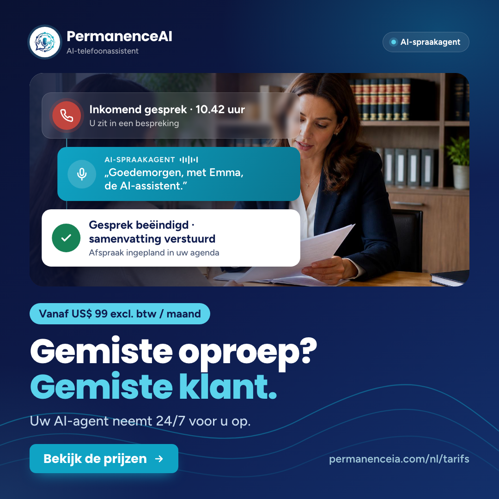
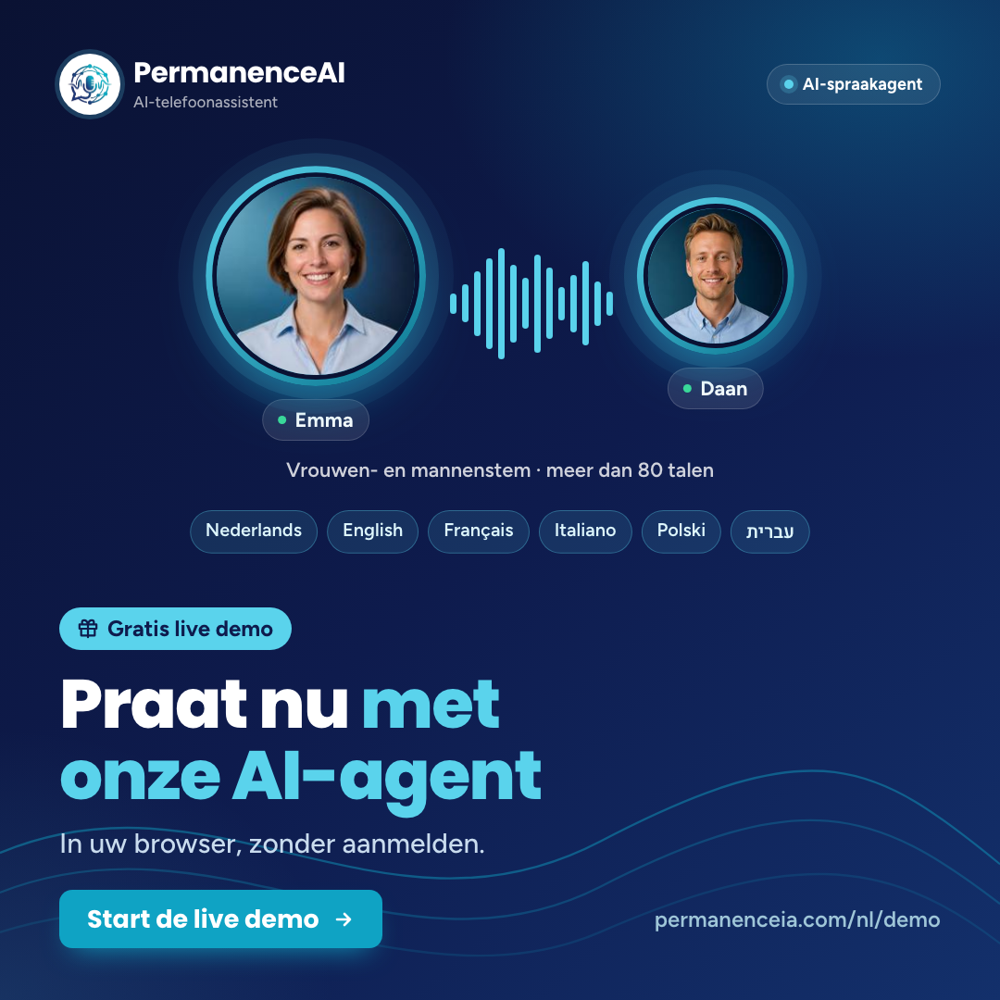
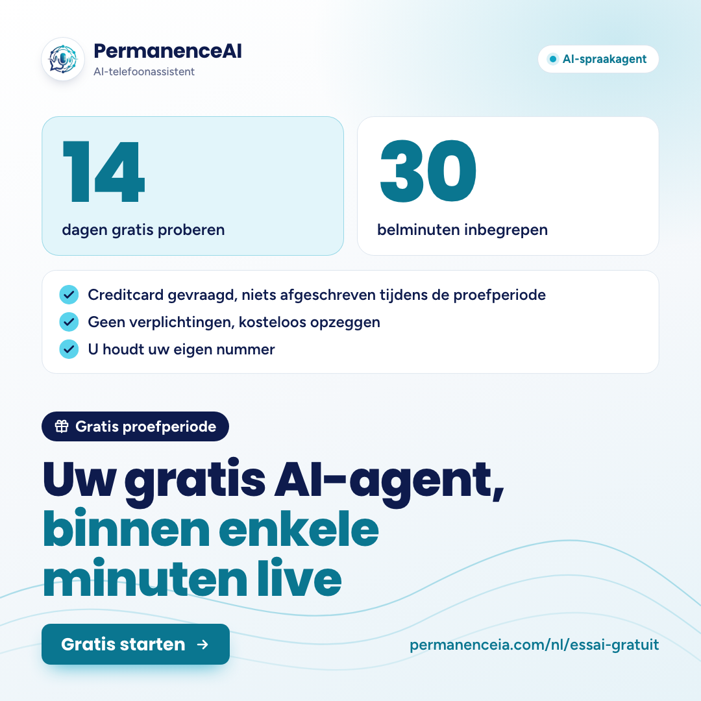

# Posts néerlandais (nl), octobre 2026 : Facebook et LinkedIn

Trois publications (thèmes A, B, C du brief commun), chacune en deux textes : Facebook (plus court, chaleureux) et LinkedIn (plus professionnel). Vouvoiement « u » comme sur le site, marque **PermanenceAI**, slogan « AI-telefoonassistent ». **Version finale relue** (relecture néerlandaise native et vérification des faits dans le dépôt, 9 octobre 2026). Rien n'est publié : à valider avant mise en ligne.

## Calendrier

Heure locale d'Amsterdam, identique à l'heure de Paris. Le passage à l'heure d'hiver du dimanche 25 octobre 2026 est pris en compte.

| Date | Thème | LinkedIn | Facebook | Page cible |
|---|---|---|---|---|
| jeu. 15/10/2026 | A | 08:30 (CEST) | 12:15 (CEST) | /nl/tarifs |
| jeu. 22/10/2026 | B | 08:30 (CEST) | 12:15 (CEST) | /nl/demo |
| jeu. 29/10/2026 | C | 08:30 (CET) | 12:15 (CET) | /nl/essai-gratuit |

## nl-A : A · Gemiste oproep = gemiste klant → de AI-agent neemt 24/7 op (semaine 1)

- **Date :** jeudi 15 octobre 2026 · LinkedIn 08:30 · Facebook 12:15 (heure d'Amsterdam, CEST UTC+2 = heure de Paris)
- **Visuels :** `nl-A-carre.png` (1080×1080, Facebook et LinkedIn) · `nl-A-linkedin.png` (1200×627, variante LinkedIn)
- **Texte sur le visuel :** Titre « Gemiste oproep? Gemiste klant. » (4 mots) · pastille « Vanaf US$ 99 excl. btw / maand » (sans pictogramme cadeau) · sous-titre « Uw AI-agent neemt 24/7 voor u op. » · bouton « Bekijk de prijzen » · adresse « permanenceia.com/nl/tarifs » · 3 cartes : « Inkomend gesprek · 10.42 uur / U zit in een bespreking », « AI-spraakagent : „Goedemorgen, met Emma, de AI-assistent.” », « Gesprek beëindigd · samenvatting verstuurd / Afspraak ingepland in uw agenda » · photo avocats-experts-comptables · pastille d'en-tête « AI-spraakagent »
- **Lien Facebook :** https://www.permanenceia.com/nl/tarifs?utm_source=facebook&utm_medium=social&utm_campaign=posts-oct-2026&utm_content=A
- **Lien LinkedIn :** https://www.permanenceia.com/nl/tarifs?utm_source=linkedin&utm_medium=social&utm_campaign=posts-oct-2026&utm_content=A



### Facebook

```text
Gemiste oproep? Gemiste klant. 📞

U zit in een bespreking, bij een klant of onderweg, en de telefoon gaat. Uw AI-telefoonassistent neemt op, 24/7. Hij meldt meteen dat hij een AI is, stelt de juiste vragen, zet de afspraak in uw agenda en stuurt u na elk gesprek een samenvatting. Zo blijft u bereikbaar, ook als u zelf even niet kunt opnemen. En u houdt gewoon uw eigen nummer.

Vanaf US$ 99 excl. btw per maand, 350 belminuten inbegrepen (Receptionist-abonnement).
👉 Bekijk de prijzen: https://www.permanenceia.com/nl/tarifs?utm_source=facebook&utm_medium=social&utm_campaign=posts-oct-2026&utm_content=A

#telefonischebereikbaarheid #mkb
```

### LinkedIn

```text
Gemiste oproep? Gemiste klant.
Wie bij een kantoor op de voicemail uitkomt, belt vaak gewoon het volgende kantoor.

Zit u in een bespreking, ontvangt u een cliënt of loopt het storm in de aangifteperiode? Dan blijft de telefoon al snel onbeantwoord. Met PermanenceAI neemt een AI-telefoonassistent uw gesprekken 24/7 aan. De agent meldt meteen dat hij een AI is, vraagt of het om een bestaande cliënt of een nieuwe zaak gaat, stelt de juiste vragen en zet het intakegesprek direct in uw agenda (Google Agenda of Outlook, via Cal.com of Calendly).

Na elk gesprek ontvangt u een samenvatting; de opname en de transcriptie vindt u terug in uw gespreksgeschiedenis. Een gevoelige vraag, of een cliënt die u persoonlijk wil spreken? Dan verbindt de agent door volgens uw regels, of noteert hij een terugbelverzoek met een samenvatting van de vraag. Meerdere gesprekken tegelijk zijn geen probleem, en u houdt uw eigen nummer via een eenvoudige doorschakeling.

Het Receptionist-abonnement kost US$ 99 excl. btw per maand, met 350 belminuten per maand inbegrepen. Geen opstartkosten, geen verplichtingen.
Bekijk alle abonnementen: https://www.permanenceia.com/nl/tarifs?utm_source=linkedin&utm_medium=social&utm_campaign=posts-oct-2026&utm_content=A

#telefonischebereikbaarheid #AI #mkb #advocatuur #accountancy
```

### Traduction française du texte Facebook

> Appel manqué ? Client manqué. 📞
>
> Vous êtes en réunion, chez un client ou en déplacement, et le téléphone sonne. Votre assistant téléphonique IA décroche, 24 h/24, 7 j/7. Il annonce d'emblée qu'il est une IA, pose les bonnes questions, inscrit le rendez-vous dans votre agenda et vous envoie un résumé après chaque appel. Vous restez ainsi joignable, même quand vous ne pouvez pas décrocher vous-même. Et vous gardez tout simplement votre numéro.
>
> Dès 99 $US HT par mois, 350 minutes d'appel incluses (forfait Réceptionniste).
> 👉 Voir les tarifs : https://www.permanenceia.com/nl/tarifs?utm_source=facebook&utm_medium=social&utm_campaign=posts-oct-2026&utm_content=A
>
> #telefonischebereikbaarheid (joignabilité téléphonique) #mkb (PME)

## nl-B : B · Hoor het zelf → live demo (semaine 2)

- **Date :** jeudi 22 octobre 2026 · LinkedIn 08:30 · Facebook 12:15 (heure d'Amsterdam, CEST UTC+2 = heure de Paris)
- **Visuels :** `nl-B-carre.png` (1080×1080, Facebook et LinkedIn) · `nl-B-linkedin.png` (1200×627, variante LinkedIn)
- **Texte sur le visuel :** Titre « Praat nu met onze AI-agent » (5 mots) · pastille « Gratis live demo » · sous-titre « In uw browser, zonder aanmelden. » · bouton « Start de live demo » · adresse « permanenceia.com/nl/demo » · portraits Emma et Daan, légende « Vrouwen- en mannenstem · meer dan 80 talen », puces de langues (6 en carré : Nederlands, English, Français, Italiano, Polski, עברית ; 5 en 1200×627, sans Italiano) · pastille d'en-tête « AI-spraakagent »
- **Lien Facebook :** https://www.permanenceia.com/nl/demo?utm_source=facebook&utm_medium=social&utm_campaign=posts-oct-2026&utm_content=B
- **Lien LinkedIn :** https://www.permanenceia.com/nl/demo?utm_source=linkedin&utm_medium=social&utm_campaign=posts-oct-2026&utm_content=B



### Facebook

```text
Hoe klinkt een AI-telefoonassistent eigenlijk? Hoor het zelf. 🎧

Praat live met Emma of Daan, onze AI-agents: gewoon in uw browser, gratis en zonder aanmelden. Liever gebeld worden? Laat uw nummer achter en de agent belt u (ma–za, 9.00–17.30 uur).

Stel uw vragen zoals een klant dat zou doen en onderbreek de agent gerust. Dertig seconden zijn genoeg om een oordeel te vormen.

👉 Start de live demo: https://www.permanenceia.com/nl/demo?utm_source=facebook&utm_medium=social&utm_campaign=posts-oct-2026&utm_content=B

#AI #telefonischebereikbaarheid
```

### LinkedIn

```text
Geloof ons niet zomaar op ons woord: praat zelf met onze AI-agent.
Dertig seconden zijn genoeg om te horen hoe een AI-telefoonassistent klinkt.

Op onze demopagina praat u live met Emma (vrouwenstem) of Daan (mannenstem), onze Nederlandstalige AI-agents. Dat kan direct in uw browser, via uw microfoon of door te typen, gratis en zonder aanmelden. Liever op uw eigen telefoon? Laat uw nummer achter en de agent belt u, van maandag tot en met zaterdag tussen 9.00 en 17.30 uur.

Kies een rol (receptionist, sales of support) en uw sector, en stel uw vragen zoals een klant dat zou doen. Onderbreek de agent of verander van onderwerp: zo hoort u hoe hij een aanvraag afhandelt. Goed om te weten: uw eigen agent herkent de taal van de beller en antwoordt in dezelfde taal, in meer dan 80 talen.

Emma en Daan zijn virtuele AI-agents: hun gezichten zijn gegenereerde illustraties, geen echte mensen.
Start de live demo: https://www.permanenceia.com/nl/demo?utm_source=linkedin&utm_medium=social&utm_campaign=posts-oct-2026&utm_content=B

#AI #spraakassistent #klantcontact #telefonischebereikbaarheid #mkb
```

### Traduction française du texte Facebook

> À quoi ressemble vraiment un assistant téléphonique IA ? Écoutez-le vous-même. 🎧
>
> Parlez en direct avec Emma ou Daan, nos agents IA : simplement dans votre navigateur, gratuitement et sans inscription. Vous préférez être appelé ? Laissez votre numéro et l'agent vous appelle (lun.–sam., 9 h–17 h 30).
>
> Posez vos questions comme le ferait un client et n'hésitez pas à interrompre l'agent. Trente secondes suffisent pour se faire une idée.
>
> 👉 Lancer la démo en direct : https://www.permanenceia.com/nl/demo?utm_source=facebook&utm_medium=social&utm_campaign=posts-oct-2026&utm_content=B
>
> #AI #telefonischebereikbaarheid (joignabilité téléphonique)

## nl-C : C · Probeer het gratis → proefperiode (semaine 3)

- **Date :** jeudi 29 octobre 2026 · LinkedIn 08:30 · Facebook 12:15 (heure d'Amsterdam, CET UTC+1 depuis le 25/10 = heure de Paris)
- **Visuels :** `nl-C-carre.png` (1080×1080, Facebook et LinkedIn) · `nl-C-linkedin.png` (1200×627, variante LinkedIn)
- **Texte sur le visuel :** Titre « Uw gratis AI-agent, binnen enkele minuten live » (7 mots) · pastille « Gratis proefperiode » · chiffres « 14 dagen gratis proberen » et « 30 belminuten inbegrepen » · coches « Creditcard gevraagd, niets afgeschreven tijdens de proefperiode », « Geen verplichtingen, kosteloos opzeggen », « U houdt uw eigen nummer » · bouton « Gratis starten » · adresse « permanenceia.com/nl/essai-gratuit » · pastille d'en-tête « AI-spraakagent »
- **Lien Facebook :** https://www.permanenceia.com/nl/essai-gratuit?utm_source=facebook&utm_medium=social&utm_campaign=posts-oct-2026&utm_content=C
- **Lien LinkedIn :** https://www.permanenceia.com/nl/essai-gratuit?utm_source=linkedin&utm_medium=social&utm_campaign=posts-oct-2026&utm_content=C



### Facebook

```text
Uw gratis AI-agent, binnen enkele minuten live. ✨

Probeer PermanenceAI 14 dagen gratis, met 30 belminuten inbegrepen. Uw AI-telefoonassistent neemt 24/7 op, plant afspraken in en stuurt u na elk gesprek een samenvatting. En u houdt gewoon uw eigen nummer.

Helder en eerlijk: bij activering vragen we een creditcard, maar tijdens de proefperiode wordt niets afgeschreven. Geen verplichtingen: zegt u vóór het einde op, dan betaalt u niets. Zo niet, dan start na 14 dagen het abonnement dat u hebt gekozen.

👉 Gratis starten: https://www.permanenceia.com/nl/essai-gratuit?utm_source=facebook&utm_medium=social&utm_campaign=posts-oct-2026&utm_content=C

#AI #mkb
```

### LinkedIn

```text
Een AI-telefoonassistent 14 dagen testen op uw eigen gesprekken, zonder dat er iets wordt afgeschreven.
Zo werkt onze gratis proefperiode.

U kiest het abonnement dat u wilt testen: de eerste 14 dagen zijn gratis, met 30 belminuten inbegrepen. Een eerste agent staat binnen enkele minuten klaar op basis van uw bedrijfsgegevens; voor de volledige configuratie (agenda, nummers, doorverbinden) rekent u meestal op één tot twee dagen, met onze begeleiding. Uw nummer blijft hetzelfde: een eenvoudige doorschakeling volstaat.

De agent neemt 24/7 op, meldt aan het begin van elk gesprek dat hij een AI is, kwalificeert de aanvraag, boekt afspraken direct in uw agenda en stuurt u na elk gesprek een samenvatting.

De voorwaarden, zwart op wit: bij activering vragen we een creditcard, maar tijdens de proefperiode wordt niets afgeschreven. Geen verplichtingen, geen opstartkosten. Zegt u vóór het einde van de 14 dagen op, dan betaalt u niets; 7 dagen voor het einde ontvangt u een herinneringsmail. Zo niet, dan start daarna het gekozen abonnement.
Gratis starten: https://www.permanenceia.com/nl/essai-gratuit?utm_source=linkedin&utm_medium=social&utm_campaign=posts-oct-2026&utm_content=C

#AI #telefonischebereikbaarheid #mkb #zzp #ondernemen
```

### Traduction française du texte Facebook

> Votre agent IA gratuit, opérationnel en quelques minutes. ✨
>
> Essayez PermanenceAI gratuitement pendant 14 jours, avec 30 minutes d'appel incluses. Votre assistant téléphonique IA répond 24 h/24, 7 j/7, prend les rendez-vous et vous envoie un résumé après chaque appel. Et vous gardez tout simplement votre numéro.
>
> Clair et honnête : à l'activation, nous demandons une carte bancaire, mais rien n'est débité pendant l'essai. Sans engagement : si vous résiliez avant la fin, vous ne payez rien. Sinon, le forfait que vous avez choisi démarre au bout de 14 jours.
>
> 👉 Démarrer gratuitement : https://www.permanenceia.com/nl/essai-gratuit?utm_source=facebook&utm_medium=social&utm_campaign=posts-oct-2026&utm_content=C
>
> #AI #mkb (PME)

## Relecture finale (9 octobre 2026) : corrections faites

**Faits (vérifiés dans le dépôt)**
- A, LinkedIn : « begint bij US$ 99 » remplacé par « kost US$ 99 » (le prix du Receptionist est fixe : 99 $ HT/mois, `src/i18n/markets.ts`) ; « 350 minuten » précisé en « 350 belminuten per maand ».
- A, LinkedIn : « samenvatting, met transcriptie en opname » laissait croire que l'enregistrement et la transcription arrivent avec le résumé. Corrigé : le résumé est envoyé, l'enregistrement et la transcription sont dans l'historique des appels (matrice, « Gespreksgeschiedenis »).
- A, LinkedIn : « herkent of het om een bestaande cliënt… gaat » remplacé par « vraagt of het om een bestaande cliënt of een nieuwe zaak gaat » (fiche secteur avocats-experts-comptables : « Bestaande cliënt of nieuwe zaak »). Terugbelverzoek « met een samenvatting van de vraag », comme dans la FAQ.
- B, LinkedIn : « Dertig seconden zijn genoeg om te horen of een AI-telefoonassistent bij uw bedrijf past » allait plus loin que la FAQ. Corrigé : « …om te horen hoe een AI-telefoonassistent klinkt ».
- B, LinkedIn : la détection de langue (« meer dan 80 talen ») concerne l'agent du client, pas la démo où l'on choisit la langue. Corrigé : « uw eigen agent herkent de taal van de beller… ».
- C, LinkedIn : « rekent u op één tot twee dagen » complété par « meestal », comme dans la FAQ (« meestal op één tot twee dagen »).
- C, visuel : la coche « Creditcard gevraagd, niets afgeschreven » pouvait se lire « jamais rien débité ». Corrigé : « Creditcard gevraagd, niets afgeschreven tijdens de proefperiode » (badge du site ; versions en-gb, it et pl déjà ainsi).
- A, visuel : pictogramme cadeau retiré de la pastille de prix « Vanaf US$ 99 excl. btw / maand » (un cadeau à côté d'un prix prête à confusion). Option `badgeicon=-` ajoutée à la copie `nl/post.html` ; le gabarit commun n'est pas modifié.

**Langue**
- A, Facebook : « bij een cliënt » → « bij een klant » (public large ; « cliënt » reste dans le texte LinkedIn qui vise avocats et comptables) ; « plant de afspraak in uw agenda » (particule « in » en double) → « zet de afspraak in uw agenda » ; « Hij meldt meteen… ».
- A, LinkedIn : « Wie bij een kantoor de voicemail krijgt » → « Wie bij een kantoor op de voicemail uitkomt » ; « is het volop aangifteperiode » → « loopt het storm in de aangifteperiode » ; « gaat de telefoon al snel over zonder dat iemand opneemt » → « blijft de telefoon al snel onbeantwoord » ; « neemt … uw lijn 24/7 aan » (pas idiomatique) → « neemt … uw gesprekken 24/7 aan ».
- B, LinkedIn : « Geloof ons niet op ons woord: praat er zelf mee » → « Geloof ons niet zomaar op ons woord: praat zelf met onze AI-agent » ; « met een vrouwen- en een mannenstem » → « Emma (vrouwenstem) of Daan (mannenstem) ».
- C : « krijgt 14 dagen met 30 belminuten inbegrepen » → « de eerste 14 dagen zijn gratis, met 30 belminuten inbegrepen » ; « Anders start daarna… » → « Zo niet, dan start na 14 dagen… » ; « 7 dagen vooraf » → « 7 dagen voor het einde » ; « plant afspraken in uw agenda » → « boekt afspraken direct in uw agenda » (formule du site).

**Visuels**
- Les 6 PNG ont été régénérés (Chrome sans interface, `render.mjs` : dimensions exactes, polices du site chargées) puis relus un par un : texte lisible, sans faute, rien de coupé. En 1200×627, la coche « …tijdens de proefperiode » passe sur deux lignes, proprement.

## Contrôles faits

- Chiffres, tous lus dans le dépôt : 14 jours et 30 minutes d'essai (`markets.ts`, `trial`), US$ 99 excl. btw / maand et 350 minutes (Receptionist, `markets.ts`, format « US$ 99 » identique au site), 24/7, plus de 80 langues (`ui/components.ts`), démo par téléphone lundi–samedi 9.00–17.30 uur (`liveDemo.sentText`), e-mail de rappel 7 jours avant la fin et configuration complète « meestal » en 1 à 2 jours (`faq.ts`), Emma et Daan (`src/data/personas.ts`), « geen opstartkosten, geen verplichtingen » (`faq.ts`).
- Mention IA dans chaque texte et sur chaque image (pastille « AI-spraakagent » en en-tête, plus le titre ou les cartes) ; Emma et Daan présentés comme agents IA virtuels.
- Aucun secteur santé en pause (dentaire, kinés, médecine esthétique), aucune promesse de conformité santé, aucun résultat chiffré promis, pas de « rappel automatique » (A dit « noteert hij een terugbelverzoek »).
- Essai (C) : carte demandée, rien n'est débité pendant l'essai, sans engagement, annulation sans frais avant la fin, puis démarrage du forfait choisi ; jamais « sans carte ».
- « Binnen enkele minuten live » (titre C) : repris du pop-up `trialNudge` validé ; le texte LinkedIn précise qu'il s'agit d'un premier agent et que la configuration complète prend en général 1 à 2 jours.
- Liens : `src/pages/tarifs.tsx`, `demo.tsx` et `essai-gratuit.tsx` existent ; `nl` figure dans `src/i18n/locales.ts` et dans `next.config.js` ; les trois pages `/nl/…` répondent 200 en ligne. UTM `utm_source=facebook|linkedin&utm_medium=social&utm_campaign=posts-oct-2026`, plus `utm_content=A|B|C` (facultatif).
- Dates : 15, 22 et 29 octobre 2026 sont bien des jeudis ; heure d'été jusqu'au 25 octobre.

## Fichiers

- `visuels.json` : réglages des 6 visuels. Rendu : `node docs/marketing/posts-2026-10/nl/render.mjs docs/marketing/posts-2026-10/nl/visuels.json <dossier>` puis renommer `<id>_1080x1080.png` → `<id>-carre.png` et `<id>_1200x627.png` → `<id>-linkedin.png`.
- `post.html` : copie du gabarit avec trois ajouts propres à cette copie (le gabarit commun `gabarit/post.html` n'est pas modifié) : `cards=start` et `stackw` (cartes du thème A à gauche, pour laisser visible l'avocate à droite de la photo) ; un retour à la ligne `\n` respecté dans le titre et les cartes (évite « AI- / assistent » et « AI- / agent ») ; `badgeicon=-` (masque le pictogramme cadeau de la pastille, utilisé pour le prix du thème A).
- Le visuel B en 1200×627 n'affiche que 5 puces de langue (Italiano retiré) pour éviter une puce seule sur une ligne.
